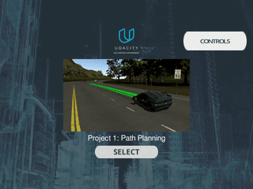
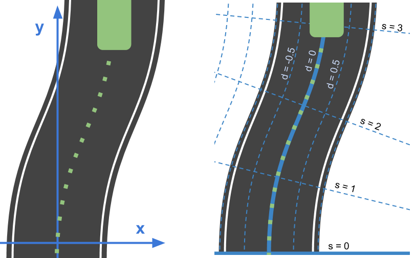
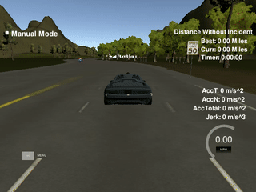

# CarND-Path-Planning-Project
Self-Driving Car Engineer Nanodegree Program

### Result Video:
[](https://www.youtube.com/watch?v=Dl7vKgYSeFg)

### 1. Goal of this project and challenges.
In this project your goal is to safely navigate around a virtual highway with other traffic that is driving +-10 MPH of the 50 MPH speed limit. You will be provided the car's localization and sensor fusion data, there is also a sparse map list of waypoints around the highway. The car should try to go as close as possible to the 50 MPH speed limit, which means passing slower traffic when possible, note that other cars will try to change lanes too. The car should avoid hitting other cars at all cost as well as driving inside of the marked road lanes at all times, unless going from one lane to another. The car should be able to make one complete loop around the 6946m highway. Since the car is trying to go 50 MPH, it should take a little over 5 minutes to complete 1 loop. Also the car should not experience total acceleration over 10 m/s^2 and jerk that is greater than 10 m/s^3.
   
## 2. First tests.

The first tests were written to get a better feeling for the simulation and the API.

### 2.1 Driving in a straight line:

To get the car to run in a straight line, we simply push the next coordinates in `next_x_vals` and `next_y_vals`:

```C
void PathPlanner::driveStraightLine(){

  for(int i = 0; i < FUTURE_PATH_SIZE; i++)
  {
    next_x_vals.push_back(car_x+(DIST_INC*i)*cos(deg2rad(car_yaw)));
    next_y_vals.push_back(car_y+(DIST_INC*i)*sin(deg2rad(car_yaw)));
  }

}
```
The test can be run with: `./path_planning -s`.

Result:

 

### 2.2 Driving in a straight line:

Driving the car in a circle is similar straight forward. 

```C
void PathPlanner::driveCircles(){
	double pos_x;
	double pos_y;
	double angle;
	int path_size = previous_path_x.size();

	for(int i = 0; i < path_size; i++)
	{
		next_x_vals.push_back(previous_path_x[i]);
		next_y_vals.push_back(previous_path_y[i]);
	}

	if(path_size == 0)
	{
		pos_x = car_x;
		pos_y = car_y;
		angle = deg2rad(car_yaw);
	}
	else
	{
		pos_x = previous_path_x[path_size-1];
		pos_y = previous_path_y[path_size-1];

		double pos_x2 = previous_path_x[path_size-2];
		double pos_y2 = previous_path_y[path_size-2];
		angle = atan2(pos_y-pos_y2,pos_x-pos_x2);
	}


	for(int i = 0; i < FUTURE_PATH_SIZE-path_size; i++)
	{    
		next_x_vals.push_back(pos_x+(DIST_INC)*cos(angle+(i+1)*(M_PI/100)));
		next_y_vals.push_back(pos_y+(DIST_INC)*sin(angle+(i+1)*(M_PI/100)));
		pos_x += (DIST_INC)*cos(angle+(i+1)*(M_PI/100));
		pos_y += (DIST_INC)*sin(angle+(i+1)*(M_PI/100));
	}
}
```

Result:

 

## 3. Driving on the Highway

### 3.1 Following the lane 
It is difficult to get a car to follow a line on a highway using x- and y-coordinates. Therefore we are using frenet coordinates. The values s and d describe the position on the car relative to the road:



Using frenet coordinates and the map waypoints, it is very easy and straight forward to follow a lane:

``` C
void PathPlanner::followLane(){

	for(int i = 0; i < FUTURE_PATH_SIZE; i++)
	{
		double next_s = car_s+(i+1)*DIST_INC;
		double next_d = 6;
		vector<double> xy = getXY(next_s, next_d, map_waypoints_s, map_waypoints_x, map_waypoints_y);
		next_x_vals.push_back(xy[0]);
		next_y_vals.push_back(xy[1]);
	}
}
```

 

### 3.2 Smoothing the paths

As it can be seen in the gif above, simply following the waypoints create very harsh turns. The jerk created is to high, therefore it is necessary  to smooth the paths. 

To accomplish this, splines were used: http://kluge.in-chemnitz.de/opensource/spline/

First we need some anchor points for the spline. I used** 4 anchor points:**
- 1 point in the past 
- 1 point of the current position of the car
- 2 points in the future, 45m and 90m in front of of the current position

``` C
 // calculate current and last state
	if (prev_size < 2){
		double prev_car_x = car_x - cos(car_yaw);
		double prev_car_y = car_y - sin(car_yaw);

		ptsx.push_back(prev_car_x);
		ptsx.push_back(car_x);

		ptsy.push_back(prev_car_y);
		ptsy.push_back(car_y);
	}
	else{
		ref_x = previous_path_x[prev_size-1];
		ref_y = previous_path_y[prev_size-1];

		double ref_x_prev = previous_path_x[prev_size-2];
		double ref_y_prev = previous_path_y[prev_size-2];
		ref_yaw = atan2(ref_y-ref_y_prev, ref_x-ref_x_prev);

		ptsx.push_back(ref_x_prev);
		ptsx.push_back(ref_x);

		ptsy.push_back(ref_y_prev);
		ptsy.push_back(ref_y);
	}

    //In Frenet add spaced points ahead of the starting reference
	vector<double> next_wp1 = getXY(car_s+55, (2+4*lane), map_waypoints_s, map_waypoints_x, map_waypoints_y);
	vector<double> next_wp2 = getXY(car_s+90, (2+4*lane), map_waypoints_s, map_waypoints_x, map_waypoints_y);

	ptsx.push_back(next_wp1[0]);
	ptsx.push_back(next_wp2[0]);

	ptsy.push_back(next_wp1[1]);
	ptsy.push_back(next_wp2[1]);
```

To prevent more than 1 y-value for each x-value, we transform the global coordinates into local coordinates:

``` C
//Global coordinate to Local coordinate
	for (int i = 0; i < ptsx.size(); i++)
	{
		double shift_x = ptsx[i]-ref_x;
		double shift_y = ptsy[i]-ref_y;

		ptsx[i] = (shift_x*cos(0-ref_yaw)-shift_y*sin(0-ref_yaw));
		ptsy[i] = (shift_x*sin(0-ref_yaw)+shift_y*cos(0-ref_yaw));
	}
```

After this, the spline-values can be calculated, transformed into global coordinates again and be pushed as the new path-points:

``` C
      double x_point = x_add_on+(target_x)/N;
      double y_point = s(x_point);

      x_add_on = x_point;

      double x_ref = x_point;
      double y_ref = y_point;

      // go back to global coordinate
      x_point = x_ref*cos(ref_yaw)-y_ref*sin(ref_yaw);
      y_point = x_ref*sin(ref_yaw)+y_ref*cos(ref_yaw);

      x_point += ref_x;
      y_point += ref_y;

      next_x_vals.push_back(x_point);
      next_y_vals.push_back(y_point);
```
 
 Result of smoothing the path with splines:
  
 
 ### 3.3 Avoiding collisions
 
 Using the sensor fusion data, we can identify the position of other cars around us. By checking the relative s-distance, the car can avoid collisions. To get a better breaking response, the strength of the brake are broken into the 3 areas
 - too close
 - very close
 - emergency close
 

``` C
	for (int i=0;i<sensorfusion.size();i++){
	float otherCar_d = sensorfusion[i][6]; //#get the d-value (horizontal position) from the i-th car
		
		//If the car is in our lane
		if(otherCar_d < (4*(lane+1)) && otherCar_d > (4*lane)){
			double otherCar_s = sensorfusion[i][5]; //#get the s-value from the i-th car
			double distance_to_car = otherCar_s-car_s;
			
			if(distance_to_car<SAFETY_DISTANCE && distance_to_car>0){
				too_close = true;
				double otherCar_vx = sensorfusion[i][3];
				double otherCar_vy = sensorfusion[i][4];
				otherCar_speed = sqrt(abs((otherCar_vx)*(otherCar_vx))+abs((otherCar_vy)*(otherCar_vy))); //pythagoras 
				otherCar_speed = otherCar_speed * 3.6 / 1.6; // convertion from m/s to kmh. and then from km/h to mp/h

				if(distance_to_car<SAFETY_DISTANCE/3){
					very_close = true;
					if(distance_to_car<SAFETY_DISTANCE/6){
						emergency_close = true;
					}
				}
			}
		}
```

For each distance-range, there is a different breaking response (-0,3, -0,8 and -3):
``` C
//don't drive a lower speed than the car in front of our car
		if(!(car_speed < otherCar_speed) && car_speed > 1){
			ref_vel-=0.3;

			if(very_close){
				cout << "Harsher break." << endl;
				ref_vel-=0.8;

				if(emergency_close){
					cout << "EMERGENCY BREAK. HOLD YOUR HAT." << endl;
					ref_vel-=3;
				}
			}
		}
 ```
  ### 3.3 Changing lanes
  
 In addition to breaking, the system checks if a lane change is possible. Again, the sensorfusion data is used to find out the distance to the other cars.
 
 ``` C
 	//Check for all possible lanes, if a change is possible
	for(int l=0;l<lanes_possible.size();l++){
		
		//Check all cars from sensorfusion
		for (int i=0;i<sensorfusion.size();i++){
			float otherCar_d = sensorfusion[i][6]; //#get the d-value (horizontal position) from the i-th car
			//Is the car is in the lane we want to change into?
			if((otherCar_d < (4*(lanes_possible[l]+1)) && otherCar_d > (4*lanes_possible[l]))){
				
				//Distance between my car and the car #i
				double otherCar_s = sensorfusion[i][5]; //#get the s-value from the i-th car
				double distance_to_car = otherCar_s-car_s;

				//lane in lanes_possible[l] is checked for cars in front. 
				//The array distance_to_closest_car_in_lane_in_front will have the closest car in front for every lane.
				//This is used if several lanes are possible
				if((distance_to_car > 0) && (distance_to_car < distance_to_closest_car_in_lane_in_front[lanes_possible[l]])){
					distance_to_closest_car_in_lane_in_front[lanes_possible[l]] = distance_to_car;
					cout << "There is a car on lane " << lanes_possible[l] << " with a distance of" << distance_to_car << endl;
				}

				//Check if there is a car in a lane to change.
				//Check if the car is inside the SAFETY-zone (from +SAFETY_DISTANCE to SAFETY_DISTANCE/3) 
				if((distance_to_car<SAFETY_DISTANCE) && distance_to_car>(SAFETY_DISTANCE/-3)){	
					cout << "I can't change to lane " << lanes_possible[l] << ". The distance is only " << distance_to_car << endl;
					lanes_possible.erase(lanes_possible.begin()+l); //Car is in the way. Lanechange to index l is not possible.
					l--; //because of the erase, to get the order right
					
					break;
				}
			}
		}
	}
 ```
 
 ## 4. Results

Putting everything together, the system works very well. The video shows the system driving a distance of 6 miles very reliable and quick.

[](https://www.youtube.com/watch?v=Dl7vKgYSeFg)

---

	     
### Simulator.
You can download the Term3 Simulator which contains the Path Planning Project from the [releases tab (https://github.com/udacity/self-driving-car-sim/releases).


#### The map of the highway is in data/highway_map.txt
Each waypoint in the list contains  [x,y,s,dx,dy] values. x and y are the waypoint's map coordinate position, the s value is the distance along the road to get to that waypoint in meters, the dx and dy values define the unit normal vector pointing outward of the highway loop.

The highway's waypoints loop around so the frenet s value, distance along the road, goes from 0 to 6945.554.

## Basic Build Instructions

1. Clone this repo.
2. Make a build directory: `mkdir build && cd build`
3. Compile: `cmake .. && make`
4. Run it: `./path_planning`.

Here is the data provided from the Simulator to the C++ Program

#### Main car's localization Data (No Noise)

["x"] The car's x position in map coordinates

["y"] The car's y position in map coordinates

["s"] The car's s position in frenet coordinates

["d"] The car's d position in frenet coordinates

["yaw"] The car's yaw angle in the map

["speed"] The car's speed in MPH

#### Previous path data given to the Planner

//Note: Return the previous list but with processed points removed, can be a nice tool to show how far along
the path has processed since last time. 

["previous_path_x"] The previous list of x points previously given to the simulator

["previous_path_y"] The previous list of y points previously given to the simulator

#### Previous path's end s and d values 

["end_path_s"] The previous list's last point's frenet s value

["end_path_d"] The previous list's last point's frenet d value

#### Sensor Fusion Data, a list of all other car's attributes on the same side of the road. (No Noise)

["sensor_fusion"] A 2d vector of cars and then that car's [car's unique ID, car's x position in map coordinates, car's y position in map coordinates, car's x velocity in m/s, car's y velocity in m/s, car's s position in frenet coordinates, car's d position in frenet coordinates. 

## Details

1. The car uses a perfect controller and will visit every (x,y) point it recieves in the list every .02 seconds. The units for the (x,y) points are in meters and the spacing of the points determines the speed of the car. The vector going from a point to the next point in the list dictates the angle of the car. Acceleration both in the tangential and normal directions is measured along with the jerk, the rate of change of total Acceleration. The (x,y) point paths that the planner recieves should not have a total acceleration that goes over 10 m/s^2, also the jerk should not go over 50 m/s^3. (NOTE: As this is BETA, these requirements might change. Also currently jerk is over a .02 second interval, it would probably be better to average total acceleration over 1 second and measure jerk from that.

2. There will be some latency between the simulator running and the path planner returning a path, with optimized code usually its not very long maybe just 1-3 time steps. During this delay the simulator will continue using points that it was last given, because of this its a good idea to store the last points you have used so you can have a smooth transition. previous_path_x, and previous_path_y can be helpful for this transition since they show the last points given to the simulator controller with the processed points already removed. You would either return a path that extends this previous path or make sure to create a new path that has a smooth transition with this last path.

## Tips

A really helpful resource for doing this project and creating smooth trajectories was using http://kluge.in-chemnitz.de/opensource/spline/, the spline function is in a single hearder file is really easy to use.

---

## Dependencies

* cmake >= 3.5
 * All OSes: [click here for installation instructions](https://cmake.org/install/)
* make >= 4.1
  * Linux: make is installed by default on most Linux distros
  * Mac: [install Xcode command line tools to get make](https://developer.apple.com/xcode/features/)
  * Windows: [Click here for installation instructions](http://gnuwin32.sourceforge.net/packages/make.htm)
* gcc/g++ >= 5.4
  * Linux: gcc / g++ is installed by default on most Linux distros
  * Mac: same deal as make - [install Xcode command line tools]((https://developer.apple.com/xcode/features/)
  * Windows: recommend using [MinGW](http://www.mingw.org/)
* [uWebSockets](https://github.com/uWebSockets/uWebSockets)
  * Run either `install-mac.sh` or `install-ubuntu.sh`.
  * If you install from source, checkout to commit `e94b6e1`, i.e.
    ```
    git clone https://github.com/uWebSockets/uWebSockets 
    cd uWebSockets
    git checkout e94b6e1
    ```

## Editor Settings

We've purposefully kept editor configuration files out of this repo in order to
keep it as simple and environment agnostic as possible. However, we recommend
using the following settings:

* indent using spaces
* set tab width to 2 spaces (keeps the matrices in source code aligned)

## Code Style

Please (do your best to) stick to [Google's C++ style guide](https://google.github.io/styleguide/cppguide.html).

## Project Instructions and Rubric

Note: regardless of the changes you make, your project must be buildable using
cmake and make!


## Call for IDE Profiles Pull Requests

Help your fellow students!

We decided to create Makefiles with cmake to keep this project as platform
agnostic as possible. Similarly, we omitted IDE profiles in order to ensure
that students don't feel pressured to use one IDE or another.

However! I'd love to help people get up and running with their IDEs of choice.
If you've created a profile for an IDE that you think other students would
appreciate, we'd love to have you add the requisite profile files and
instructions to ide_profiles/. For example if you wanted to add a VS Code
profile, you'd add:

* /ide_profiles/vscode/.vscode
* /ide_profiles/vscode/README.md

The README should explain what the profile does, how to take advantage of it,
and how to install it.

Frankly, I've never been involved in a project with multiple IDE profiles
before. I believe the best way to handle this would be to keep them out of the
repo root to avoid clutter. My expectation is that most profiles will include
instructions to copy files to a new location to get picked up by the IDE, but
that's just a guess.

One last note here: regardless of the IDE used, every submitted project must
still be compilable with cmake and make./

## How to write a README
A well written README file can enhance your project and portfolio.  Develop your abilities to create professional README files by completing [this free course](https://www.udacity.com/course/writing-readmes--ud777).

